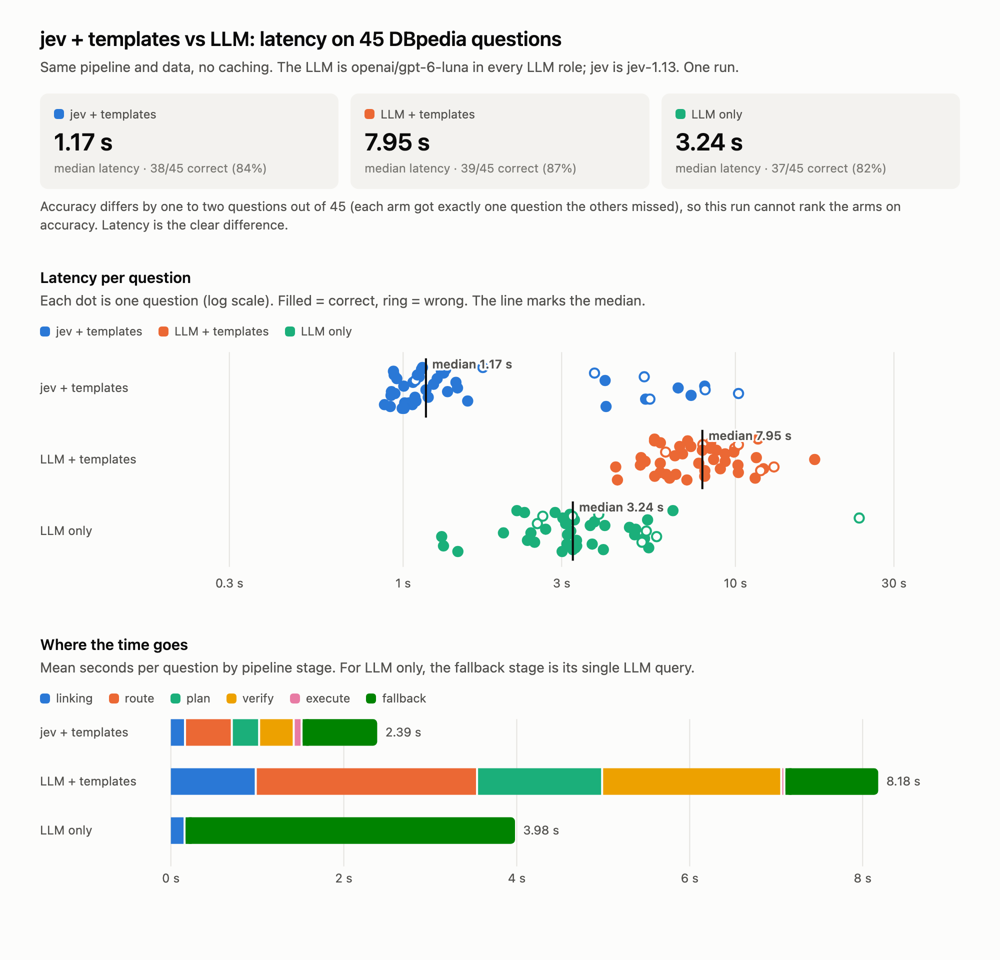

# kgqa: System One routing layer for knowledge-graph QA

A fast controller (jev, via the TypeSafe `system_one` API) makes typed, confidence-gated decisions:
which graph, which class, which query shape, which schema path, and whether the result answers the
question. Templates or an LLM then write *small* SPARQL queries against a schema slice, and plain
code executes them, carrying bindings across graph boundaries.

- Design: [docs/architecture.md](docs/architecture.md)
- What's built, decisions, next steps: [docs/implementation-plan.md](docs/implementation-plan.md)

## Benchmark: jev + templates vs LLM



45 QALD-9 questions on a DBpedia films / people / places slice (~695k triples), no caching, one
run. jev is `jev-1.13`; every LLM role uses `openai/gpt-6-luna`.

- **jev + templates:** jev makes the routing and planning decisions, templates write the SPARQL, and
  the LLM only handles what templates cannot express.
- **LLM + templates:** the same pipeline with the LLM answering jev's questions, which isolates the
  decision-maker.
- **LLM only:** the LLM writes one query per question from retrieved schema.

What it shows:
- Each jev decision takes ~0.3 s against 1.5–2.4 s for the LLM. End to end, the median is 2.8×
  faster than LLM only and 6.8× faster than the same pipeline driven by the LLM.
- Accuracy is a tie (84 / 87 / 82%, one or two questions apart). This run cannot rank the arms on it.
- The slow tail is the LLM fallback: the ~20% of questions templates cannot express take 3–10 s,
  so jev's p95 (7.9 s) is higher than LLM only's (5.7 s).
- LLM only is flattered by DBpedia, whose vocabulary the model has seen in training. A private
  graph removes that advantage.

Reproduce (needs `OPENROUTER_API_KEY`; a few cents), then regenerate the page and this image:

```bash
scripts/timing_benchmark.sh
```

```bash
.venv/bin/python scripts/plot_timing.py
```

## Quickstart (offline, no API keys)

```bash
uv venv && uv pip install -e ".[dev]"
```

```bash
.venv/bin/kgqa build
```

```bash
.venv/bin/kgqa ask "What was the total revenue from F-150 orders in 2025?" --trace
```

```bash
.venv/bin/kgqa eval --arms C
```

```bash
.venv/bin/python -m pytest -q
```

`build` loads the sample graph (`data/sample/`: catalog, sales and people as three named
graphs) into an embedded Oxigraph store and writes schema cards and the entity index to `.kgqa/`.
`eval` writes `reports/latest/report.md`.

Out of the box the controller is `heuristic`, an offline lexical stand-in for jev, so everything
runs without keys. Its numbers are a floor, not a measurement of jev.

## Plugging in the real services

**jev:** `pip install typesafe-sdk`, export `TYPESAFE_API_KEY`, then in `kgqa.toml`:

```toml
[controller]
backend = "typesafe"
```

**LLM via OpenRouter** (arms A and B, `auto` generation, the fallback path): export
`OPENROUTER_API_KEY`, then pass `--llm openrouter` (and optionally `--model some/model:free`) to
`ask` or `eval`, or set `backend = "openrouter"` under `[llm]`. Responses are cached in
`.kgqa/llm-cache.jsonl`, so reruns don't spend quota.

```bash
.venv/bin/kgqa eval --arms A,B,C --llm openrouter
```

**Any other LLM:** fill in `examples/llm_adapter.py` or write your own factory, then:

```toml
[llm]
backend = "python:examples.llm_adapter:make"
```

## Other commands

```bash
.venv/bin/kgqa schema order dealer
```

```bash
.venv/bin/kgqa ask "How many employees work in the Pacific region?" --json --trace
```

```bash
.venv/bin/kgqa fetch --endpoint https://query.wikidata.org/sparql --query examples/wikidata/automobile_models.rq --out data/wikidata/automobiles.nt
```

## Pointing at your own graph

Copy `kgqa.toml` and edit it. Add one `[[modules]]` block per named graph (graph IRI, description,
files, type predicate), plus the ontology and SHACL files if you have them. Cards fall back to
statistics when you don't. Declare shared-identifier joins in the ontology with
`kgqa:joinsWith` or a shared `kgqa:identifierScheme`. Then run `kgqa build`. To use a running
endpoint (QLever, Oxigraph server) set `[store] kind = "http"` and `endpoint`.

Benchmarks: native JSON (see `data/sample/benchmark.json`), QALD JSON, or LC-QuAD 2.0 JSON, via
`kgqa eval --benchmark path`.
