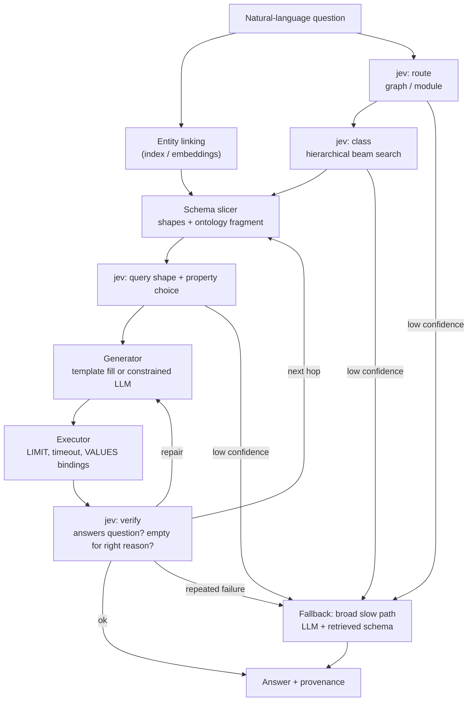

# System One Routing Layer for Knowledge Graph QA

Status: draft / exploration
Scope: prototype on open KG datasets, designed to transfer to OBDA-materialized enterprise graphs.

## 1. Problem

Natural-language question answering over large RDF graphs built from many sources fails for reasons that are mostly not about query execution:

- The LLM cannot hold the full ontology and shapes in context, so it guesses properties, picks the wrong graph, or invents IRIs.
- A single "perfect" SPARQL query over the whole graph is a hard generation target and a hard planning target for the engine.
- Errors are silent: a wrong route or wrong property usually returns an empty or plausible-but-wrong result, not an error.

## 2. Idea

Split the work into a fast **controller** and a slow **generator**.

- **Controller (System One, jev):** makes typed, calibrated, low-latency decisions: which graph, which class, what query shape, which property, is this result adequate. Returns choices, probabilities and confidence that ordinary code branches on.
- **Generator (LLM or templates):** writes small SPARQL queries against a schema slice the controller has already selected.
- **Executor (plain code):** runs queries, carries intermediate bindings forward, enforces limits and timeouts.

The unit of work changes from "one optimized query for the whole graph" to "a short sequence of small, verified queries."

## 3. Goals and non-goals

Goals
- Reduce prompt size by slicing schema per question.
- Make routing and fallback decisions explicit, measurable and confidence-gated.
- Support cross-graph questions through intermediate queries.
- Produce an evaluation harness that compares against a single-query LLM baseline.

Non-goals
- Replacing SPARQL generation with jev. Jev classifies and scores; it does not emit text.
- Reasoning or inference beyond what the triple store already materializes.
- Production hardening (auth, multi-tenancy) in the prototype.

## 4. Architecture overview



## 5. Components

### 5.1 Schema cards (offline)

One card per graph module and per class, built from the ontology and SHACL shapes plus data statistics.

Each card contains:
- Class and property IRIs with human-readable labels and descriptions.
- Cardinalities and value types from SHACL shapes.
- Property usage frequency and a few sample values.
- Links to other modules (shared identifier schemes, `owl:sameAs` coverage).

SHACL is used as a compact, machine-readable schema summary, not as a query language. Queries are SPARQL.

### 5.2 Entity linking

Resolves mentions ("the Defender", "Q3 2025") to IRIs or typed literals using a label/alias index plus embedding lookup. Done outside the LLM so identifiers are never guessed. Returns candidate IRIs with scores; ambiguous mentions surface as jev Choice questions over the candidates.

### 5.3 Router (jev)

Hierarchical classification using Choice questions chained level by level (module, then class, then subclass), with beam search over probabilities so top-K paths are kept rather than committing greedily. A Choice question accepts up to 255 options, so module and class lists can usually be given in full rather than shortlisted. Include an `other / none of the above` option at every level.

### 5.4 Schema slicer

Assembles the prompt context for the selected path only: the class card, its neighbours within N hops, and the shapes for properties likely to be needed. Target is a small fixed token budget regardless of graph size.

### 5.5 Query planner (jev)

Atomic questions asked together in one call, each evaluated independently:

- Query shape: lookup, count, aggregation, path traversal, comparison, boolean.
- Property choice among candidates shortlisted from the slice.
- Whether the question needs a second hop or a second graph.
- Whether it needs an ordering, limit or filter.

Complex judgments are decomposed into separate questions and combined in code, following jev's own guidance.

### 5.6 Generator

Two modes, selected by shape and confidence:
- **Template mode:** a small library of parameterized SPARQL templates per shape. Jev fills slots by choosing among candidate IRIs. Fully deterministic given the answers.
- **Constrained LLM mode:** an LLM writes SPARQL against the slice only, with allowed IRIs enumerated. Output is checked against the slice before execution.

### 5.7 Executor

- Every query gets a `LIMIT` and a timeout.
- Intermediate results are passed to the next hop as `VALUES` bindings. Keep intermediate sets bounded (see Section 9).
- Cross-graph steps use `SERVICE` where the store supports it, otherwise application-side joins.
- Logs every query, latency, row count and the jev answers that produced it.

### 5.8 Verifier (jev)

Noul or Choice questions over the question and the result summary:
- Does this result answer the question?
- If empty: wrong property/graph, or genuinely no such data?
- Do value types match the shapes?

Outcomes: accept, run next hop, repair (regenerate with the failure attached), or fall back.

### 5.9 Fallback path

A broader, slower path: LLM plus retrieved schema producing a single query, or a human-review queue. Triggered by any low-confidence gate or repeated verification failure. This is the safety net for silent misroutes, so its rate is a first-class metric.

## 6. Jev interface sketch

Request shape follows the TypeSafe `system_one` API: a `state` plus a map of typed questions, one call, answers with `choice`, `probabilities`, `confidence`.

```python
from typesafe_sdk import Choice, TypeSafeClient

def route(question: str, modules: dict[str, str]) -> dict:
    with TypeSafeClient() as client:
        resp = client.system_one(
            state=question,
            questions={
                "module": Choice(
                    instructions="Which data module holds the answer?",
                    criteria={**modules, "other": "None of the modules fit"},
                ),
                "shape": Choice(
                    instructions="What kind of query does this need?",
                    criteria={
                        "lookup": "Fetch attributes of one entity",
                        "count": "How many entities match",
                        "aggregate": "Sum, average, min, max over entities",
                        "path": "Follow relations across two or more entities",
                        "compare": "Compare two or more entities",
                        "boolean": "Yes/no about a fact",
                    },
                ),
            },
        )
    return resp.answers
```

Gating pattern (thresholds are starting points, tune on the dev set):

```python
if a["module"].confidence < 0.5 or a["module"].choice == "other":
    return fallback(question)
# close second choice: run both routes in parallel and merge or verify
runners_up = [m for m, p in a["module"].probabilities.items()
              if m != a["module"].choice and p > 0.25]
```

## 7. Datasets

| Dataset | Why | Notes |
|---|---|---|
| Wikidata | Large, real, has a natural two-graph split for testing cross-graph routing | Public query service has a 60 s hard timeout; graph split into main and scholarly on 9 May 2025. Use a domain slice or a local endpoint (QLever, qEndpoint, Oxigraph). |
| Bio2RDF / UniProt-style graphs | Multiple curated sources joined by shared identifiers, closest to the multi-source enterprise setup | Verify current availability and dumps before committing. |
| DBLP / DBpedia | Smaller prototypes, faster iteration | A few GB rather than hundreds. |
| QALD, LC-QuAD 2.0, SciQA | Questions with gold SPARQL for evaluation | Confirm licences and the exact graph version each targets. |

Start with a single domain slice, then add a second graph to exercise cross-graph steps.

## 8. Evaluation

Three arms on the same benchmark questions:

- **A. Baseline:** LLM plus retrieved schema, single SPARQL query.
- **B. Router + LLM:** jev routing and slicing, constrained LLM generation.
- **C. Router + templates:** jev routing and slot filling, no LLM generation where a template applies.

Metrics
- Execution accuracy against gold answers.
- Latency p50 and p95, end to end and per stage.
- Cost per question (LLM tokens plus jev tokens).
- Timeout rate.
- Fallback rate, and accuracy on the fallback subset.
- Router calibration: does confidence track correctness? Report reliability curves per gate.
- Failure attribution: entity linking vs routing vs property choice vs generation vs execution.

Expected shape of the result (a hypothesis to test, not a finding): gains show up mostly in latency, cost and calibrated fallback, with accuracy roughly comparable to a strong baseline. If accuracy on Wikidata questions is dominated by identifier errors, entity linking will matter more than routing.

## 9. Constraints and risks

- **Cross-graph joins** need shared identifiers or `owl:sameAs`. Weak linking loses answers at the hop boundary regardless of routing quality.
- **Error compounding:** each hop adds a chance of misrouting or a wrong sub-query. Keep hops few and verify between them.
- **Silent misroutes:** mitigated by confidence gates, `other` options and the fallback path, but the gate thresholds need calibration data.
- **Intermediate result size:** federation experiments on Wikidata suggest pushing around 100k bindings costs seconds and millions approach the timeout. Cap and paginate.
- **Engine planner may already win:** a good engine (QLever, for instance) may plan joins as well as hand-split intermediate queries. Splitting helps where the first hop is far more selective than the planner infers. Measure before assuming.
- **Jev latency and accuracy on this task are unverified.** The docs describe parallel evaluation and cheap extra questions but I have not seen absolute latency figures; benchmark early.
- **Virtual vs materialized (enterprise transfer):** with OBDA and a virtual engine such as Ontop, SPARQL is rewritten to SQL and the source optimizer does the work, so intermediate queries may cost less than on a materialized store. Materialization may still win for heavy reasoning or cross-source joins.

## 10. Suggested repo layout

```
kg-system-one/
  architecture.md
  data/            # dumps, slices, build scripts
  store/           # local endpoint config (QLever / Oxigraph / qEndpoint)
  schema/          # schema card builder, SHACL ingestion, stats
  linking/         # label index, embeddings, entity resolver
  router/          # jev questions, hierarchical beam search, gating
  planner/         # shape + property questions, templates
  generator/       # template fill, constrained LLM
  executor/        # SPARQL client, VALUES passing, limits
  verifier/        # jev verification questions, repair loop
  fallback/        # slow path
  eval/            # benchmark loaders, arms A/B/C, metrics, reports
```

## 11. Milestones

1. Stand up a local endpoint with one domain slice; write the schema card builder.
2. Entity linking plus baseline arm A on a benchmark subset, to get the number to beat.
3. Router (module, class) with confidence gating; arm B.
4. Query shape and property planner with templates; arm C.
5. Verifier and repair loop; measure fallback rate and calibration.
6. Add a second graph and cross-graph questions; test intermediate-query composition.
7. Write up results; decide what transfers to the OBDA-materialized enterprise setup.

## 12. Open questions

- What is jev's real per-call latency and accuracy on ontology-scale option lists (100 to 255 classes or properties)?
- Do templates cover enough of the benchmark to matter, or does most traffic need constrained generation?
- How should low-confidence ties be handled: run both routes, or fall back immediately?
- How much does SHACL detail (versus plain ontology plus statistics) improve property choice?
- Can the verifier reliably distinguish "empty because wrong property" from "empty because no data"?
